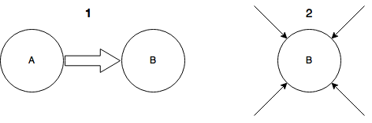

# Design
This document presents a rough idea about the design we plan to implement.

## End goal
We start by describing the desired end product.

The product of this study should represent flows in Switzerland. 
Flows are very likely to vary depending on the date and time of the tweets, as well as various
events, such as the opening of a new freeway... Thus, the representation of those flows should take all those factors into account.
In order to visualize these flows in a clear way, we choose to create an interface with a dynamic representation of the flows. 

The image above represents an idea of what the end product should look like. Of course, our map will be scaled so that only relevant areas are represented (Switzerland, and part of its neighboring coutries).
The visualization should convey the same ideas:
- The importance of the flow (shown by the thickness of the lines)
- The nature of the flow (shown by the starting point and the color of the lines)

In addition, additional tools should enable users to visualize flows at different point in time (date, time, special event).

## Thinking about Flows 

**People flow**: refers to numerous people moving around buildings, around cities or across borders. 

**Question** : what kind of flows are we interested in ?

* Option 1 represents a big flows between two mains geographical nodes, in our context we can imagine nodes as cities. 
* Option 2 represents several individual flows comming from small places to one main node (we can also imagine little flows from a main nodes to smaller places).

Given the pretty large geographical zone we have to consider, it doesn't really scale, or even make sense to look into individual moves of people to a same node. We should probably limit our analysis to movement between important points of Switzerland, as modeled by *figure 1*.

## Modeling Flows
### Nodes
If we consider a flow as a being movement from a node to another, we need to decide what is a node. 

It makes sense here to considere cities as nodes, and so detect movement between cities. Of course we still need to decide what cities are large enough to be able to add more information in our analysis.

It might also make sense to consider larger geographical zones as nodes in order to detect less precise flows. This might be significant in our analysis to evaluate the amount of people crossing borders for example, but since people don't necessarly cross the border to work in the same place, we should maybe not only consider cities for these particular cases.

### Edges
There are two ways to think of links between nodes : 

* An edge represents only movement between two nodes, without geographical significance. 
* An edge also brings geographical information about the flow between two nodes. 

More concretely, in the current context, the question is : *should we consider roads between cities ?*

Intuitively, it would make sense, given it brings more precise information of the flow, by knowing with path people exactly take.

Now we have to keep in mind that our analysis is based on tweets, which needs either a laptop or a smartphone to be posted, and it seems reasonable to consider that people *don't text and drive*. So if one can tweet in city A, and later in the day in city B, there is very little chance that one tweets while traveling from A to B. 
*But*, driving is not the only way to travel in Switzerland, it's absolutely fine to post a tweet in the train, so this could be a good reason to look into intermediate tweets, which could gives us information about the use of train lines, given that there is a chance that most people not professionaly active (16 - 25 years old), -or even some active people- take the train on a daily basis. 

## Detecting Flows
### Detection strategy 
*When can we say that someone is moving in a flow ?*

** Potential idea:** 
- A flow should not be determined by only one person. Assuming the path of one person at a certain time, we need to see whether several people use the same path.
- Additionaly, since flows depend on the time and date at which the map is visualized, only paths that occur within a certain period should be taken into account when building a flow. 

* Tweet in location A, in location B, how often ? Per day ? Per week ?  
* Which direction ? Starting point is early tweet, if 2 tweets in the same day. Otherwise harder... Can we assume someone goes from the smallest to the biggest city between A and B ?

*When can we say that a flow is significant ?*

* Probably when a lot of people take it ?
* Save starting date 

### Detecting cities
*Given a point (longitude, latitude), how can we find the corresponding node ?*

* See [Geonames](http://download.geonames.org/export/dump/). There is a file for CH, linking each city to its coordinates. Finding **nearest neighbor** in this file ?
* What is close enough to be considered in the city ?

*Which cities to consider ? Which population ?*

* Test with different parameters ?

### Detecting paths
Per person, find tweets that are not close to a city ? What is close ?

If some tweets found, we can open a sub-flow of A -> B. 

Look if tweet is along roads or train lines ? Look at [this](https://github.com/vasile/transit-map/blob/master/api/geojson/edges.geojson).

### Across borders ?
Try to simply find user that post regularly in and out CH ? To get a rough idea of how much are the borders crossed ?

## Putting it all together
*How to go from the tweets to the described end product?*

1. Build list of tweets belonging to the same user, emmited in a certain time period (1 day for example).
2. Filter out lists that can not be used for flow detection (lists with unique tweets, lists with tweets posted in the same location).
3. We are left with relevant list of tweets. For every list, create a path consisting of the nodes where the tweets were posted.
4. Filter out paths which are only used by a minority. This leaves us with the most important flows.
5. Visualize those paths on a map.

# Warning
**It seems all of this relies on the fact that a lot of people (at least a good amount) tweet often enough ?**